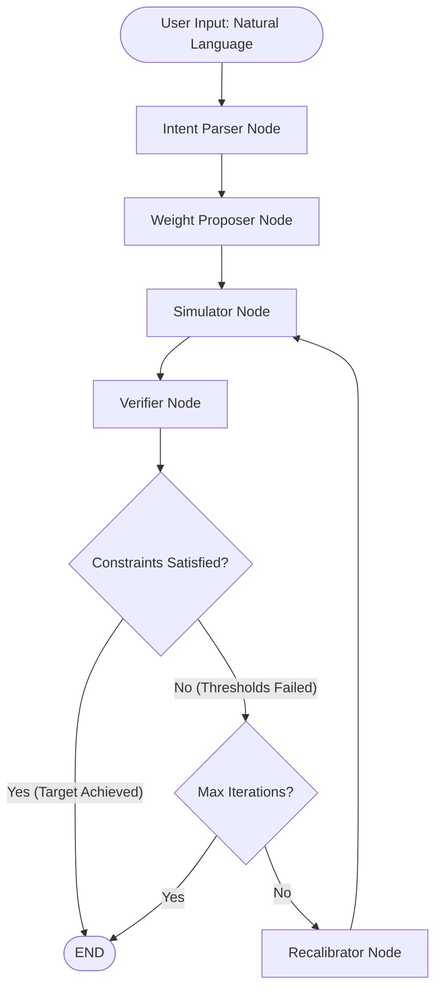

# Agentic Intent-Based Network (IBN) Optimizer

This repository contains an LLM-powered Agentic Framework designed to solve multi-objective service placement problems on the edge-cloud continuum. It acts as an intelligent middleware that translates natural language operator intents into strict mathematical weights, orchestrates a black-box heuristic simulator, actively recalibrates those weights to navigate the approximate Pareto front, and finds optimal solutions or negotiates trade-offs when solutions are infeasible.

## Architecture Overview

The system is built using **LangGraph**, structuring the LLM operations in a ReAct (Reason + Act) loop method. This architecture prevents LLM hallucinations by separating semantic reasoning from deterministic mathematical verification.

### System Workflow (State Graph)



---

## File Structure

```text
 ┣━  prompts/              # System prompts for LLM tuning
 ┃ ┣━  parser_system_prompt.md
 ┃ ┣━  proposer_system_prompt.md
 ┃ ┗━  recalibration_system_prompt.md
 ┣━  simulation/           # Containes two algorithms, topology and workload generators and core simulation parameters and weights.
 ┃ ┣━  config.py           
 ┃ ┣━  generator.py        
 ┃ ┣━  greedy_fast.py        
 ┃ ┣━  heuristics.py        
 ┃ ┣━  main.py            
 ┃ ┣━  rollout_worker.py        
 ┃ ┣━  structs.py        
 ┃ ┗━  runs/               # Contains valid runs in csv format for warm-starting
 ┣━  test/                 # Test scripts for node verification (unit)
 ┃ ┣━  test_parser.py
 ┃ ┣━  test_proposer.py
 ┃ ┣━  test_recalibration.py
 ┃ ┗━  test_verifier.py
 ┣━  tools/
 ┃ ┗━  tools.py            # LangChain tool wrapping the simulator
 ┣━  utils/
 ┃ ┣━  retriever.py        # RAG functionality for querying historical runs
 ┃ ┗━  analytics.py        # Analyses runs and gathers information for later evaluation
 ┣━  state.py              # LangGraph AgentState definition
 ┣━  nodes.py              # Core agent logic (Parser, Proposer, Verifier, Recalibrator)
 ┣━  app.py                # LangGraph orchestrator (Edges & Conditional Routing)
 ┗━  main.py               # Streamlit Frontend

```

---

## Core Components

### 1. State Management (`state.py`)

To solve the problem of "Agent Amnesia" during extended optimization loops, the state maintains a strict memory hierarchy:

* `original_parsed_intent`: Immutable: Stores the operator's exact initial goals once after intent_parser_node runs.
* `active_parsed_intent`: Mutable working memory: Allows the agent to autonomously drop constraints if a request proves physically infeasible.
* `recalibration_history`: An array tracking every failed weight combination and the exact simulation feedback, preventing the LLM from getting stuck in loops.

### 2. The Nodes (`nodes.py`)

* **Intent Parser (Inverse Translator):** Uses Pydantic structured output to translate human intents ("keep latency under 400ms") into a machine-readable JSON schema (with `primary_objective`, `hard_constraints`, `soft_preferences`, `non_relaxable_constraints` and `relaxation_order`).
* **Weight Proposer (Warm-Start):** Addresses the "Rugged" Pareto Front. Because LLMs possess semantic bias (e.g., assuming higher latency weights always yield better latency), this node uses a RAG-oriented `retriever.py` to query historical successful runs. The LLM is structured to follow Pydantic baselines and makes micro-adjustments.
* **Verifier (Deterministic):** Written as pure Python logic (no LLM). It evaluates the simulation metrics (`norm_lat`, `norm_cost`, `norm_sec`) against the active constraints and catches capacity failures (`failures > 0`), ensuring zero arithmetic hallucination.
* **Recalibrator (Adaptive Search):** Analyzes negative feedback from the Verifier. It performs fine-tuned mathematical adjustments or, if an SLA is impossible, negotiates trade-offs by relaxing constraints based on the user's defined `relaxation_order`.

### 3. The Tool Layer (`tools.py`)

Bridges the LangGraph agent and the underlying simulation.

* **Optimization:** Employs global caching for the network topology and application workload (`_CACHED_TOPO`, `_CACHED_APPS`). This ensures they are generated only once per session based on `config.SEED`, cutting out redundant computation during the agentic loop.
* **Safeguards:** Instead of allowing the LLM to write raw tool-call parameters, the orchestration extracts the proposed weights from the state and injects them into `config.py`.

### 4. Graph Orchestration (`app.py`)

Constructs the `StateGraph`. Implements a conditional edge routing function (`route_verification`) with an enforced `max_iterations` limit, which is crucial given the computational expense of the `app_rollout` simulator.

---

## Interactive UI (`main.py`)

The project features a **Streamlit** frontend designed to visualize the internal reasoning (chain of thought) of the agent. Once we run an optimization with an intent as input, a JSON file is generated containing analytics about the process (fail/success, final weights, constraint relaxations, number of iterations, token usage, etc), which is saved in a `results-analytics` directory ready to be used for further evaluation. 

### How to Run

Due to the `ProcessPoolExecutor` utilized in the simulation's `app_rollout`, the entry point is strictly protected with `multiprocessing.freeze_support()` to prevent recursive process spawning on Windows.

1. Clone the repo and install dependencies that might be needed.
2. Ensure you have your `ANTHROPIC_API_KEY` set in a `.env` file. (or similar key for API calls)
3. Run the Streamlit server:
```bash
streamlit run main.py
```
4. The UI allows you to input natural language intents, adjust iteration limits, and watch the real-time execution logs as the agent iterates through the Parser, Proposer, Simulator, Verifier, and Recalibrator nodes.