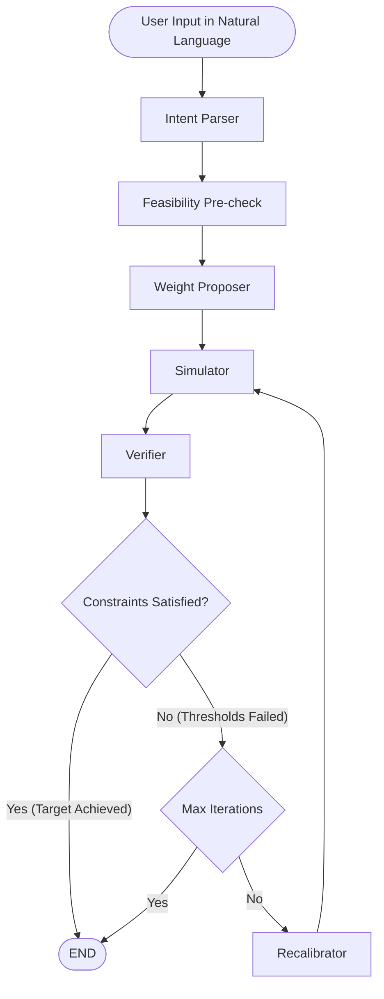

# Agentic Intent-Based Network (IBN) Optimizer

This repository contains an LLM-powered Agentic Framework designed to solve multi-objective service placement problems on the edge-cloud continuum. It translates natural language operator intents into mathematical weights, runs a black-box heuristic simulator, recalibrates those weights when the SLA fails, and asks the operator or loosens thresholds when a solution is infeasible.

## Architecture Overview

The system is built using **LangGraph**, structuring the LLM operations in a fixed deterministic graph method. Semantic reasoning is kept separate from deterministic mathematical verification, so the LLM does not do the numeric checks.

### System Workflow (State Graph)




---


## File Structure

```text
 ┣━  prompts/              # System prompts for LLM tuning
 ┃ ┣━  parser_system_prompt.md
 ┃ ┣━  proposer_system_prompt.md
 ┃ ┗━  recalibration_system_prompt.md
 ┣━  simulation/           # Contains two algorithms, topology and workload generators and core simulation parameters and weights.
 ┃ ┣━  config.py           
 ┃ ┣━  generator.py        
 ┃ ┣━  greedy_fast.py        
 ┃ ┣━  heuristics.py        
 ┃ ┣━  main.py            
 ┃ ┣━  rollout_worker.py        
 ┃ ┣━  structs.py        
 ┃ ┗━  runs/               # Contains valid runs in csv format for warm-starting
 ┣━  test/                 # Test scripts for node verification (unit)
 ┃ ┣━  test_parser.py
 ┃ ┣━  test_proposer.py
 ┃ ┣━  test_recalibrator.py
 ┃ ┣━  test_feasibility.py
 ┃ ┣━  test_retriever.py
 ┃ ┣━  test_safety_guards.py
 ┃ ┣━  test_verifier.py
 ┃ ┣━  test_analytics.py
 ┃ ┗━  test_plots.py
 ┣━  operator-help/        # Reviewer guides (demo intents + how to read figures)
 ┃ ┣━  intents.md
 ┃ ┗━  plots.md
 ┣━  tools/
 ┃ ┗━  tools.py            # LangChain tool wrapping the simulator
 ┣━  utils/
 ┃ ┣━  retriever.py        # Retrieval-based warm-start functionality for querying historical runs
 ┃ ┣━  analytics.py        # Writes per-run JSON with info and a full attempt log
 ┃ ┗━  plots/              # Read-only matplotlib figures from JSON/CSV
 ┣━  scripts/
 ┃ ┣━  generate_dataset.py # Generate valid_runs.csv (Near-neighbor seed × weight sweep)
 ┃ ┣━  plot_run.py         # Regenerate per-run figures from one JSON
 ┃ ┣━  plot_dataset.py     # Rugged-front / Pareto / algorithm comparison
 ┃ ┗━  plot_batch.py       # Aggregate figures over a folder of run JSONs
 ┣━  state.py              # LangGraph AgentState definition
 ┣━  nodes/                # LangGraph Node implementations
 ┃ ┣━ __init__.py          # Public API re-exports
 ┃ ┣━ llm.py               # Shared ChatAnthropic client
 ┃ ┣━ parser.py            # Natural Language to structured intent
 ┃ ┣━ proposer.py          # Warm-start + micro-adjust weights
 ┃ ┣━ feasibility.py       # Deterministic historical pre-check + HITL apply
 ┃ ┣━ recalibrator.py      # Search + graduated threshold relaxation
 ┃ ┣━ simulator.py         # Invoke the placement tool and store results
 ┃ ┣━ schemas.py           # MetricType, IntentSchema, unit labels
 ┃ ┣━ verifier.py          # Deterministic SLA checks
 ┃ ┗━ weights.py           # Clip + normalization
 ┣━  app.py                # LangGraph orchestrator (Edges & Conditional Routing)
 ┗━  main.py               # Streamlit Frontend

```

---


## Core Components


### 1. State Management (`state.py`)

To solve the problem of "Agent Amnesia" during extended optimization loops, the state maintains a strict memory hierarchy:

- `original_parsed_intent`: Immutable: Stores the operator's exact initial goals once after intent_parser_node runs.
- `active_parsed_intent`: Mutable working memory. Hard-constraint **thresholds** may be loosened after evidence-based HITL or in-loop graduated relaxation.
- `recalibration_history`: An array tracking every failed weight combination and the exact simulation feedback, so the LLM can see past failed attempts.


### 2. The Nodes (`nodes/`)

- **Intent Parser (Inverse Translator):** Uses Pydantic structured output to translate human intents ("keep latency under 400ms") into a machine-readable JSON schema (with `primary_objective`, `hard_constraints`, `soft_preferences`, `non_relaxable_constraints` and `relaxation_order`). If the parser cannot map the objectives to the internal optimization standrards (e.g., due to unrecognized metrics), the operator is asked to rephrase the intent.
- **Feasibility:** Deterministic pre-check against historical runs. If the SLA is beyond best-known bounds, the operator is asked to continue, loosen thresholds, or enter a new intent. `app_rollout` may be auto-selected when it is jointly feasible and `best_fit` is not. If multiple thresholds are set, and the historical runs prove that they can not be met simultaneously, the operator is given the choice of relaxing one of them in order to restore feasibility. These suggestions are per algorithm, meaning that each suggested new threshold is the algorithm's best value plus a 5% margin. Picking the `app_rollout` option switches the live algorithm.
- **Weight Proposer (Warm-Start):** Because LLMs possess semantic bias (e.g., assuming higher latency weights always yield better latency), this node uses `retriever.py` to query historical successful runs through a pandas filter and warm-start from those runs. Per weight vector, outcomes are averaged across the retrieved near-neighbor seeds before ranking, so a lucky single seed cannot dominate the initial guess. The LLM is structured to follow Pydantic baselines and makes code-guided micro-adjustments. History is filtered to `WARM_START_SEEDS` (similar past instances), not the live `SEED`.
- **Verifier (Deterministic):** Written as pure Python logic (no LLM). It evaluates mean operator-unit metrics (`avg_latency`, `avg_cost`, `avg_security`) against the active constraints and catches capacity failures (`failures > 0`), ensuring zero arithmetic hallucination.
- **Recalibrator (Adaptive Search):** Analyzes negative feedback from the Verifier. It performs fine-tuned weight adjustments or, after at least three distinct failed weight vectors, may loosen a relaxable hard-constraint threshold and report the gap versus the original SLA.


### 3. The Tool Layer (`tools.py`)

Bridges the LangGraph agent and the underlying simulation.

- **Optimization:** Employs global caching for the network topology and application workload (`_CACHED_TOPO`, `_CACHED_APPS`). This ensures they are generated only once per session based on the live `config.SEED`, cutting out redundant computation during the agentic loop. Warm-start and feasibility read `WARM_START_SEEDS` (near-neighbor historical instances), not the live seed.
- **Safeguards:** Instead of allowing the LLM to write raw tool-call parameters, the orchestration extracts the proposed weights from the state and injects them into `config.py`.


### 4. Graph Orchestration (`app.py`)

Constructs two graphs: `parse_app` (Parser → Feasibility) and `search_app` (Proposer → Simulator → Verifier ⇄ Recalibrator). Streamlit pauses after parsing the input if a rephrase is necessary. It also pauses after Feasibility check when historical evidence shows the SLA is infeasible. `route_verification` still enforces an iteration cap through `max_iterations` that can be directly specified by the user though the slider in the left sidebar of the UI. That way, if the agent has not yet found successful weights and the iterations done reach the limit, an exit is enforced.

### 5. Metrics

- `avg_cost` / `avg_latency` / `avg_security`: mean per-app values in operator units
(cost units, ms, security score). Parser, verifier, and retriever use these.
- `norm_cost` / `norm_lat` / `norm_sec`: sums of per-app min-max scores over the
50-app workload. Each per-app score is roughly in [0, 1]; the sums are
typically tens, not values in [0, 1]. Used by the heuristic objective and
stored in CSVs, but not used for SLA checks.


### 6. Live instance vs historical warm-start

A **seed** is one generated topology plus one 50-app batch. The agent places the live seed (`SEED = 210`). Warm-start and feasibility read **near-neighbor** historical seeds (`WARM_START_SEEDS = 200-209`), never the live seed, unless `WARM_START_MODE = "oracle"` (idealized case). Continuous generator ranges are collapsed to a tight band and every app has exactly 5 services, so the historical instances may resemble to the live batch without actually being clones.

One CSV covers every retrieval condition. `valid_runs.csv` holds the whole pool plus the live seed. Pruning the dataset only changes which rows the retriever may read, via `WARM_START_MODE` and `WARM_START_K`:

| Condition | `WARM_START_MODE` | `WARM_START_K` | Seeds read |
|---|---|---|---|
| Idealized oracle | `oracle` | ignored | 210 (the live instance) |
| Single neighbor | `near_neighbor` | `1` | 200 |
| Double neighbor | `near_neighbor` | `2` | 200-201 |
| Five neighbors | `near_neighbor` | `5` | 200–204 |
| Full pool | `near_neighbor` | `None` | 200–209 |

By keeping `SEED` fixed across conditions, retrieval size is the only variable. Each saved run JSON records `warm_start_mode` and `warm_start_seeds`, so the condition is recoverable after the fact.

Both algorithms share `WARM_START_WEIGHT_SETS` (66 points at step 0.1). Giving both algorithms the same fine grid avoids making one of them look artificially strong in the feasibility pre-check. Grid-density experiments subsample this one grid at read time, so they need no re-generation.

Preview the plan and time estimate without simulating:

```bash
python scripts/generate_dataset.py --algorithms best_fit,app_rollout --dry-run
```

Build the full corpus (best-fit is instant, rollout dominates; resume-safe on `(seed, weights, algorithm)`):

```bash
python scripts/generate_dataset.py --algorithms best_fit,app_rollout
```

---


## Interactive UI (`main.py`)

The project features a **Streamlit** frontend designed to visualize the internal reasoning (execution log of each node) of the agent. Three preset inputs are presented in the sidebar, with the latency one being the default. These are fully editable and the operator can choose a totally new input if they want. Once we run an optimization with a valid intent as input, a JSON file is generated containing analytics about the process (fail/success, final weights, constraint relaxations, number of iterations, token usage, attempt trajectory, etc), which is saved in a `results-analytics` directory. Per-run figures (PNG + PDF) are written next to that JSON and shown on the done screen. Dataset and aggregate (batch) figures are generated on demand.

## Automated Testing

The repository includes a pytest suite in a GitHub Actions pipeline on push and pull request to main. Tests cover metric checks, weight clipping, and constraint rules. LLM node tests run if `ANTHROPIC_API_KEY` is set.

### How to Run


1. Clone the repo
2. Install dependencies `pip install -r requirements.txt`
3. Ensure you have your `ANTHROPIC_API_KEY` set in a `.env` file.
4. Run the Streamlit server:

```bash
streamlit run main.py
```

1. The UI allows you to input natural language intents, adjust iteration limits, and watch the real-time execution logs as the agent iterates through the nodes.
2. Search for the results-analytics/ folder to dive into the detailed analytics produced by each run.

